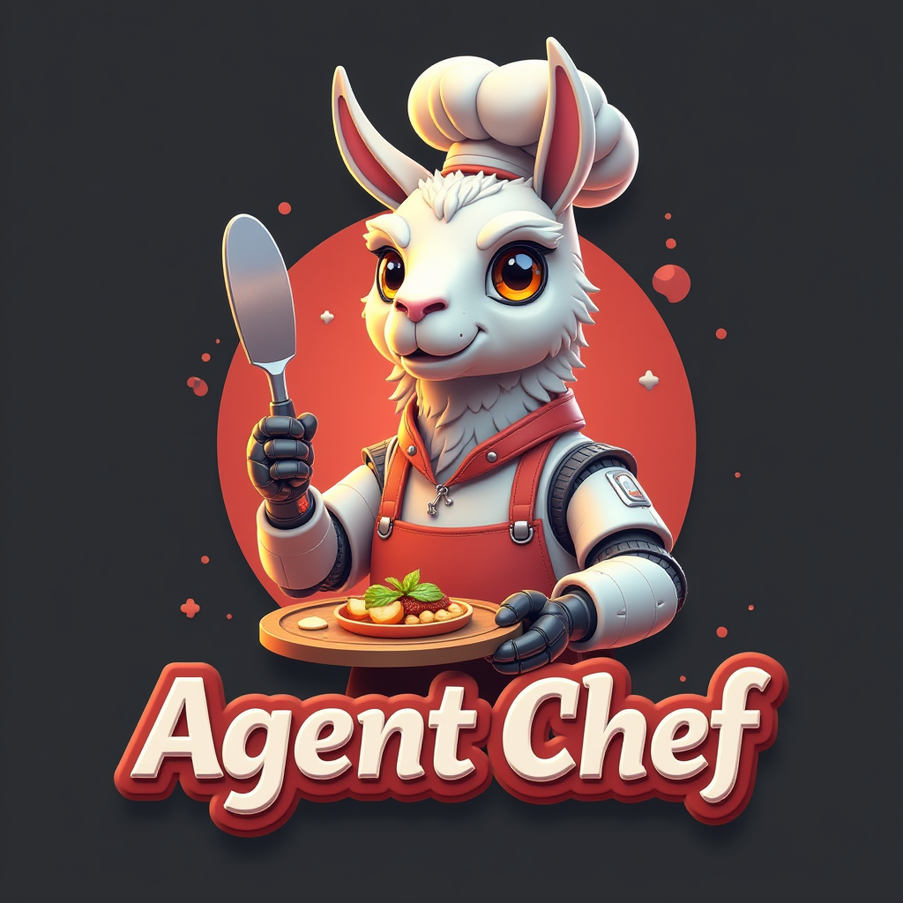

  

  
  

# 🍲Agent Chef API🥘
***[🦾Borch's AI Development Guide🦿](https://share.note.sx/c3topc9y#iaFb281+b0x66J+2lWIhWp4PV+wwoKsd5GqoXYg1i4I)***   ***[🦙 Ollama Discord Server 🦙](https://discord.gg/ollama)***   ***[🤖 OARC V0.28 VIDEO GUIDE 🧙](https://www.youtube.com/watch?v=W7TusPTnNXA)***

🍲Agent Chef API is a powerful backend tool designed for dataset refinement, structuring, and generation. It empowers users to create high-quality, domain-specific datasets for fine-tuning AI models.🥘

## Features

- 🥕**Dataset Refinement**🥩:
  - Clean and refine your existing datasets
- 🥣**Synthetic Data Generation**🥣:
  - Create procedural and synthetic datasets
- 🔪**Data Poisoning Elimination**🔪:
  - Identify and remove low-quality or malicious data
- 🍛**Specialized Dataset Construction**🍛:
  Generate datasets for specific use cases, including:
  - Function-calling
  - Programming: Python, React, C++
  - Mathematics: LaTeX, Python
  - Languages, Physics, Biology, Chemistry, Law, Cooking, wikipedias, history, context, and more!
